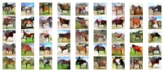

### README

依赖库：
torch=1.11.0+cu113
torchvision=0.12.0+cu113
matplotlib=2.2.3

GPU: RTX1660ti

main.py 是网络训练的主函数，修改路径即可运行网络
WGAN.py 是WGAN网络搭建的函数，无需运行
dataloader.py 是定义的数据加载器，无需运行
FID.py 是计算FID分数的程序，修改路径即可运行

target文件夹中存放了1000张生成的图片
FIDScore:133.111

##### 效果展示

